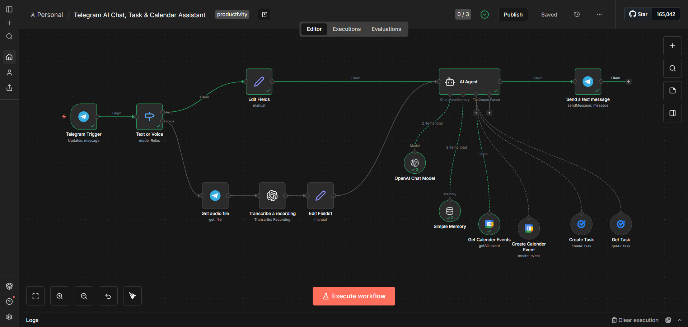

# 🤖 Telegram AI Chat, Task & Calendar Assistant

An **n8n workflow** that turns Telegram into an intelligent assistant capable of:

* 💬 Conversational AI chat
* 📝 Creating & viewing Google Tasks
* 📅 Creating & viewing Google Calendar events
* 🎙️ Voice message transcription

All interactions happen **directly inside Telegram**.

---

## ✨ Features

* **Telegram Chat Interface** – Talk to the assistant like a normal chat
* **AI Agent with Tool Calling** – Automatically decides when to create tasks or events
* **Google Tasks Integration** – Add and fetch tasks using natural language
* **Google Calendar Integration** – Schedule and view events
* **Voice Support** – Send voice notes and get them transcribed
* **Memory Support** – Maintains short conversation context

---

## 🖼️ Screenshots

Below are real screenshots from this project to show how it works end‑to‑end.

### 1️⃣ n8n Workflow Overview

Shows the complete n8n workflow including:

* Telegram trigger (text & voice)
* AI Agent with tool calling
* Google Calendar & Tasks integrations

---

### 2️⃣ Telegram Chat Interaction

Example conversation with the Telegram bot demonstrating:

* Asking general questions
* Creating a calendar event
* Fetching today’s events
* Viewing existing tasks

)

## 🛠️ Tech Stack

* **n8n** – Workflow automation
* **Telegram Bot API** – Chat interface
* **OpenAI / Gemini** – AI language models
* **Google Calendar API** – Event management
* **Google Tasks API** – Task management

---

## ⚙️ Setup Instructions

### 1. Import Workflow

* Copy the workflow JSON
* Import it into your n8n instance

### 2. Configure Credentials (Required)

You must add your own credentials inside n8n:

* Telegram Bot API
* OpenAI API (or Gemini)
* Google Calendar OAuth
* Google Tasks OAuth

> ⚠️ **Credentials are NOT included in this repository for security reasons.**

---

## 🧠 How It Works

1. User sends a message (text or voice) in Telegram
2. AI Agent analyzes intent
3. If needed, the agent automatically calls:

   * Create Task
   * Get Task
   * Create Calendar Event
   * Get Calendar Events
4. Response is sent back in plain human language

---

## 📌 Example Commands

* "Remind me to submit the report tomorrow"
* "Create a meeting on Friday at 3pm"
* "What tasks do I have?"
* "Show my events for this week"

---

## 🔒 Security & Privacy

* No API keys or secrets are stored in this repository
* All credentials must be configured locally in n8n
* Safe to use in public GitHub repositories

## 🙌 Credits

Built with ❤️ using **n8n** and **Telegram**
